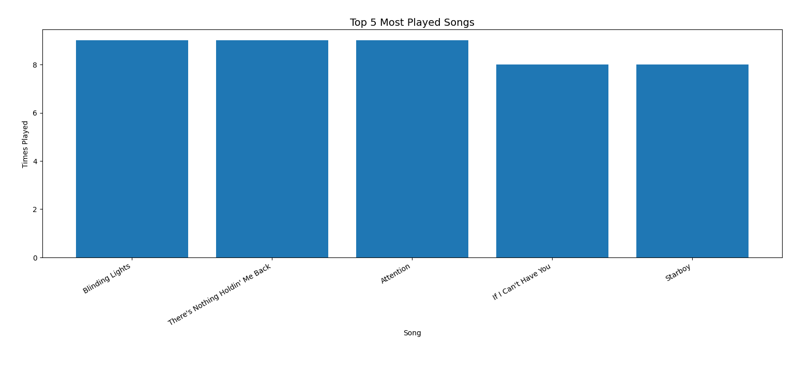
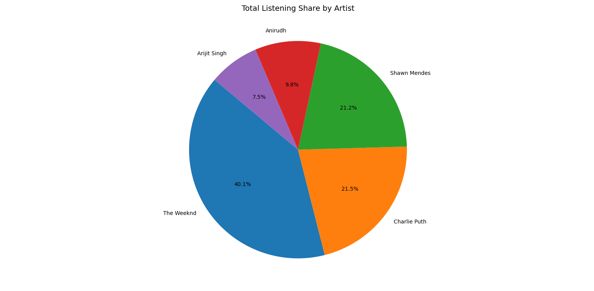

# 🎧 Spotify-Style Listening Habit Analyzer

A Python-based project that analyzes a Spotify-like listening history dataset.
The program reads music data from a CSV file, calculates total plays per artist,
identifies the most played songs, and visualizes listening habits using charts.

This project is suitable for beginners and first-year students to understand
data analysis using **Pandas** and data visualization using **Matplotlib**.

---

## 📌 Features

- Clean tabular display of listening history
- Total play count analysis per artist
- Identification of top 5 most played songs
- Data visualization using:
  - Pie chart (artist-wise distribution)
  - Bar chart (top 5 songs)

---

## 🛠️ Technologies Used

- Python 3
- Pandas
- Matplotlib

---

## 📂 Project Structure

```

spotify-listening-analyzer/
├── listening_history.csv
├── main.py
└── README.md

````

---

## ⚙️ Installation & Setup

Follow the steps below to run this project on your laptop.

### 1️⃣ Install Python

Download and install Python (version 3.8 or above):  
https://www.python.org/downloads/

Verify installation:
```bash
python --version
````

---

### 2️⃣ Download or Clone the Repository

```bash
git clone https://github.com/RARPlayzDev/Spotify-Style-Listening-Habit-Tracker.git
cd Spotify-Style-Listening-Habit-Tracker
```

---

### 3️⃣ Install Required Libraries

```bash
pip install pandas matplotlib
```

---

### 4️⃣ Run the Program

```bash
python main.py
```

---

## 📊 Sample Output

### 🔹 Listening History (Preview)

```
      Date       Artist               Song  Times_Played
2025-01-01 Arijit Singh          Tum Hi Ho             6
2025-01-01 Arijit Singh      Channa Mereya             5
2025-01-02 Arijit Singh             Raabta             4
2025-01-02 Arijit Singh   Phir Le Aaya Dil             3
2025-01-03 Arijit Singh          Muskurane             5
2025-01-04      Anirudh  Why This Kolaveri             7
2025-01-04      Anirudh       Arabic Kuthu             8
2025-01-05      Anirudh      Vaathi Coming             6
2025-01-05      Anirudh             Hukkum             5
2025-01-06      Anirudh              Hoyna             4
2025-01-01   The Weeknd    Blinding Lights             9
2025-01-01   The Weeknd    Save Your Tears             7
2025-01-02   The Weeknd            Starboy             8
2025-01-02   The Weeknd          The Hills             6
2025-01-03   The Weeknd Can't Feel My Face             5
```

---

### 🔹 Total Plays Per Artist

```
Artist
The Weeknd      123
Charlie Puth     66
Shawn Mendes     65
Anirudh          30
Arijit Singh     23
```

---

### 🔹 Top 5 Most Played Songs

```
                           Song       Artist  Times_Played
                Blinding Lights   The Weeknd             9
There's Nothing Holdin' Me Back Shawn Mendes             9
                      Attention Charlie Puth             9
            If I Can't Have You Shawn Mendes             8
                        Starboy   The Weeknd             8
```

---

## 📈 Graph Outputs

### 🎨 Artist Play Distribution (Pie Chart)



---

### 📊 Top 5 Most Played Songs (Bar Chart)



> 📌 Save the generated graphs in the same folder as the README file with the
> exact names shown above.

---

## 🎯 Learning Outcomes

* Reading and analyzing CSV data using Pandas
* Grouping and aggregating data
* Visualizing insights using Matplotlib
* Structuring a Python project for GitHub

---

## 📜 License

MIT License

Copyright (c) 2026 RARPlayz

Permission is hereby granted, free of charge, to any person obtaining a copy
of this software and associated documentation files (the "Software"), to deal
in the Software without restriction, including without limitation the rights
to use, copy, modify, merge, publish, distribute, sublicense, and/or sell
copies of the Software, and to permit persons to whom the Software is
furnished to do so, subject to the following conditions:

The above copyright notice and this permission notice shall be included in all
copies or substantial portions of the Software.

THE SOFTWARE IS PROVIDED "AS IS", WITHOUT WARRANTY OF ANY KIND, EXPRESS OR
IMPLIED, INCLUDING BUT NOT LIMITED TO THE WARRANTIES OF MERCHANTABILITY,
FITNESS FOR A PARTICULAR PURPOSE AND NONINFRINGEMENT. IN NO EVENT SHALL THE
AUTHORS OR COPYRIGHT HOLDERS BE LIABLE FOR ANY CLAIM, DAMAGES OR OTHER
LIABILITY, WHETHER IN AN ACTION OF CONTRACT, TORT OR OTHERWISE, ARISING FROM,
OUT OF OR IN CONNECTION WITH THE SOFTWARE OR THE USE OR OTHER DEALINGS IN THE
SOFTWARE.
```
